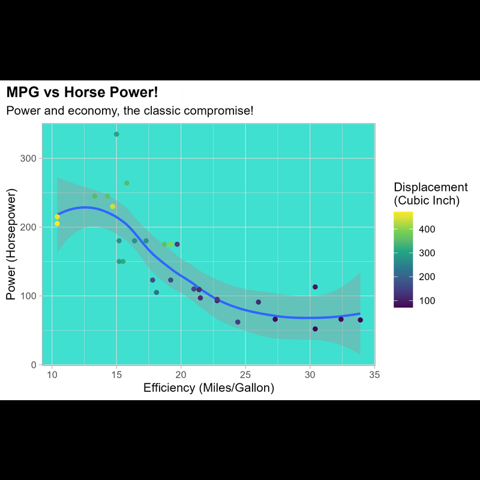

<!-- README.md is generated from README.Rmd. Please edit that file -->

```{r, echo = FALSE}
knitr::opts_chunk$set(
  collapse = TRUE,
  comment = "#>",
  warning = FALSE,
  message = FALSE
)
```


# camcorder 

<!-- badges: start -->
[](https://app.codecov.io/gh/thebioengineer/camcorder?branch=main)
[](https://github.com/thebioengineer/camcorder/actions/workflows/R-CMD-check.yaml)
<!-- badges: end -->

`{camcorder}` is an an R package to track and automatically save graphics generated with `{ggplot2}` that are created across one or multiple sessions with the eventual goal of creating a GIF showing all the plots saved sequentially during the design process. 

After installation, the package enables you to:

-  save a ggplot automatically every time you run `ggplot()` in any format with given specifications
-  generate a GIF that showcases every step of the design process using those image files
-  inspect the ggplot output directly with your specifications in the RStudio IDE—you'll get what you see[^f1]

[^f1]: In case you are saving to PDF, the file will automatically open in your default PDF viewer.

## Installation

Currently {camcorder} is only available on GitHub, and can be installed using the following command.

```{r install, eval=FALSE}
# install.packages("camcorder")
remotes::install_github("thebioengineer/camcorder")
```

## Goal End Product

The idea of tracking your plots as part of your development process and generating a making-of movie was popularized by two contributors to this project: Georgios Karamanis and Cédric Scherer. They have wowed the R community weekly with their "how its made" videos. Below are a few examples of the goal end products.

<table>
<tr>
<td>
<p><i><a href = 'https://twitter.com/cedscherer/status/1281653392859820032'>TidyTuesday 2020/28</a><br>by Cédric Scherer</i></p>

</td>
<td>
<p><i><a href = 'https://mobile.twitter.com/geokaramanis/status/1248147973206413312'>TidyTuesday 2020/15</a><br>by Georgios Karamanis</i></p>

</td>
</tr>
</table>


## How To

To get started, load {camcorder} and initialize recording using the `gg_record()` function.
This function has several options, such as where to save the recordings, device to use to save the recordings, and the height/width of the image to create. By default it will save to a temporary directory so recordings will go away once the R session is closed.

```{r setup}
library(ggplot2)
library(camcorder)

gg_record(
  dir = file.path(tempdir(), "recording100"), # where to save the recording
  device = "png", # device to use to save images
  width = 4,      # width of saved image
  height = 6,     # height of saved image
  units = "in",   # units for width and height
  dpi = 300       # dpi to use when saving image
)
```

Once the recorder is initialized, any ggplot that is made and printed will be automatically (or *automagically*[^f2]) recorded.

[^f2]: A previous typo but actually it fits quite well.

```{r plots-plots-plots, results = "hide"}
ggplot(mtcars, aes(x = mpg, y = hp)) +
  geom_point()

ggplot(mtcars, aes(x = mpg, y = hp)) + 
  geom_point(aes(shape = as.factor(gear)))

ggplot(mtcars, aes(x = mpg, y = hp)) + 
  geom_point(aes(color = as.factor(gear)))

ggplot(mtcars, aes(x = mpg, y = hp)) + 
  geom_point(aes(color = as.factor(gear))) +
  geom_path()

ggplot(mtcars, aes(x = mpg, y = hp)) +
  geom_point(aes(color = disp)) +
  geom_smooth()

ggplot(mtcars, aes(x = mpg, y = hp)) +
  geom_smooth() +
  geom_point(aes(color = disp))

ggplot(mtcars, aes(x = mpg, y = hp)) + 
  geom_smooth() +
  geom_point(aes(color = disp)) +
  scale_color_viridis_c() +
  theme_light()

ggplot(mtcars, aes(x = mpg, y = hp)) + 
  geom_smooth() +
  geom_point(aes(color = disp)) +
  scale_color_viridis_c() +
  theme_light() +
  labs(
    title = "MPG vs Horse Power!",
    subtitle = "Power and economy, the classic compromise!"
  )

ggplot(mtcars, aes(x = mpg, y = hp)) + 
  geom_smooth() +
  geom_point(aes(color = disp)) +
  scale_color_viridis_c() +
  theme_light(base_family = "Roboto Mono") +
  labs(
    title = "MPG vs Horse Power!",
    subtitle = "Power and economy, the classic compromise!"
  )

ggplot(mtcars, aes(x = mpg, y = hp)) + 
  geom_smooth() +
  geom_point(aes(color = disp)) +
  scale_color_viridis_c() +
  theme_light(base_family = "Roboto Mono") +
  labs(
    title = "MPG vs Horse Power!",
    subtitle = "Power and economy, the classic compromise!", 
    x = "Efficiency (Miles/Gallon)",
    y = "Power (Horsepower)",
    color = "Displacement\n(Cubic Inch)"
  )
```

If at any point, that you want to save your plots in a different format than what the recorder was initialized with this can be done through the `gg_resize_film()` function. This will set the size and dpi of all plots going forward.

```{r resize}
gg_resize_film(
  height = 4,
  width = 6,
  units = "in",
  dpi = 350
)
```

```{r plots-plots-plots-2, results = "hide"}
ggplot(mtcars, aes(x = mpg, y = hp)) + 
  geom_smooth() +
  geom_point(aes(color = disp)) +
  scale_color_viridis_c() +
  theme_light(base_family = "Roboto Mono") +
  labs(
    title = "MPG vs Horse Power!",
    subtitle = "Power and economy, the classic compromise!", 
    x = "Efficiency (Miles/Gallon)",
    y = "Power (Horsepower)",
    color = "Displacement\n(Cubic Inch)"
  ) +
  theme(
    plot.title.position = "plot",
    plot.title = element_text(face = "bold")
  )

ggplot(mtcars, aes(x = mpg, y = hp)) + 
  geom_smooth() +
  geom_point(aes(color = disp)) +
  scale_color_viridis_c() +
  theme_light(base_family = "Roboto Mono")  +
  labs(
    title = "MPG vs Horse Power!",
    subtitle = "Power and economy, the classic compromise!", 
    x = "Efficiency (Miles/Gallon)",
    y = "Power (Horsepower)",
    color = "Displacement\n(Cubic Inch)"
  ) +
  theme(
    plot.title.position = "plot",
    plot.title = element_text(face = "bold"),
    panel.background = element_rect(colour = "turquoise", fill = "turquoise")
  )
```

Finally, to generate the final GIF, use the `gg_playback()` function.
The user can define:
  - where the final GIF gets saved by setting the `name` argument,
  - duration of the first and last images with `first_image_duration` or `last_image_duration`
  - delay between frames in seconds with `frame_duration`


```{r create-gif, eval=FALSE}
gg_playback(
  name = file.path(tempdir(), "recording", "vignette_gif.gif"),
  first_image_duration = 5,
  last_image_duration = 15,
  frame_duration = .4,
  image_resize = 800
)
```

Once rendering is complete, a GIF is opened in your viewer.


