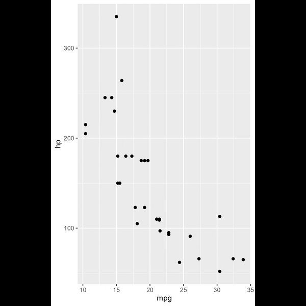

# camcorder 

<!-- badges: start -->
[](https://github.com/thebioengineer/camcorder/actions)
<!-- badges: end -->


The goal for {camcorder} is to track and record the ggplots that are created across one or multiple sessions with the eventual goal of creating a gif showing all the plots created sequentially.

## Installation

Currently {camcorder} is only available on github, and can be installed using the following command.

``` r
# install.packages("camcorder")
remotes::install_github("thebioengineer/camcorder")
```
## End Product

The idea of tracking your plots as part of your development process and generating a gif/movie was popularized by two contributors to this project: Georgios Karamanis and Cédric Scherer. They have wowed the R community weekly with their "how its made" videos. Below are a few examples of the goal end products.

<table>
<tr>
<td>
<p> Cédric Scherer, TidyTuesday 2020/28 </p>

</td>
<td>
<p> Georgios Karamanis, TidyTuesday 2020/15 </p>

</td>
</tr>
</table>


## How To

To get started, load {camcorder} and initialize recording using the `gg_record()` function.
This function has several options, such as where to save the recordings, device to use to save the recordings, and the height/width of the image to create. By default it will save to a temporary directory so recordings will go away once the rsession is closed.

```{r setup}
library(ggplot2)
library(camcorder)

gg_record(
  dir = file.path(tempdir(),"recording"), # where to save the recording
  device = "png", # device to use to save images
  width = 4, # width of saved image
  height = 6, # height of saved image
  units = "in", # units for width and height
  dpi = 300 # dpi to use when saving image
)
```

Once the recorder is initialized, any ggplot that is made and printed will be automagically recorded.

```{r plots-plots-plots, results = "hide"}

ggplot(mtcars) +
  geom_point(aes(x = mpg, y = hp))

ggplot(mtcars) + 
  geom_point(aes(x = mpg, y = hp, shape = as.factor(gear)))

ggplot(mtcars) + 
  geom_point(aes(x = mpg, y = hp, color = gear))

ggplot(mtcars) +
  geom_point(aes(x = mpg, y = hp, color = gear)) +
  geom_smooth(aes(x = mpg, y = hp))

ggplot(mtcars) +
  geom_smooth(aes(x = mpg, y = hp)) +
  geom_point(aes(x = mpg, y = hp, color = gear))

ggplot(mtcars) + 
  geom_smooth(aes(x = mpg, y = hp)) +
  geom_point(aes(x = mpg, y = hp, color = gear)) +
  theme_light()

ggplot(mtcars) + 
  geom_smooth(aes(x = mpg, y = hp)) +
  geom_point(aes(x = mpg, y = hp, color = gear)) +
  theme_light()+
  ggtitle("MPG vs Horse Power!")

ggplot(mtcars) + 
  geom_smooth(aes(x = mpg, y = hp)) +
  geom_point(aes(x = mpg, y = hp, color = gear)) +
  theme_light()+
  ggtitle("MPG vs Horse Power!")+
  labs(subtitle = "Power and economy, the classic compromise!")

ggplot(mtcars) + 
  geom_smooth(aes(x = mpg, y = hp)) +
  geom_point(aes(x = mpg, y = hp, color = gear)) +
  theme_light()+
  ggtitle("MPG vs Horse Power!")+
  labs(
    subtitle = "Power and economy, the classic compromise!", 
    x = "Efficiency (Miles/Gallon)",
    y = "Power (Horsepower)")

```

If at any point, that you want to save your plots in a different format than what the recorder was initialized with this can be done through the `gg_resize_film()` function. This will set the size and dpi of all plots going forward.

```{r resize}

gg_resize_film(
  height = 4,
  width = 6,
  units = "in",
  dpi = 350
)

```

```{r plots-plots-plots-2, results = "hide"}

ggplot(mtcars) + 
  geom_smooth(aes(x = mpg, y = hp)) +
  geom_point(aes(x = mpg, y = hp, color = gear)) +
  theme_light()+
  ggtitle("MPG vs Horse Power!")+
  labs(
    subtitle = "Power and economy, the classic compromise!", 
    x = "Efficiency (Miles/Gallon)",
    y = "Power (Horsepower)") +
  theme(
    legend.position = "bottom",
    panel.background = element_rect(colour = "green")
  )

ggplot(mtcars) + 
  geom_smooth(aes(x = mpg, y = hp)) +
  geom_point(aes(x = mpg, y = hp, color = gear)) +
  theme_light()+
  ggtitle("MPG vs Horse Power!")+
  labs(
    subtitle = "Power and economy, the classic compromise!", 
    x = "Efficiency (Miles/Gallon)",
    y = "Power (Horsepower)") +
  theme(
    legend.position = "bottom",
    panel.background = element_rect(colour = "green",fill = "green")
  )

```

Finally, to generate the final gif, use the `gg_playback()` function.
The user can define:
  - where the final gif gets saved by setting the `name` argument,
  - duration of the first and last images with `first_image_duration` or `last_image_duration`
  - delay between frames in seconds with `frame_duration`


```{r}

gg_playback(
  name = file.path(tempdir(),"recording","vignette_gif.gif"),
  first_image_duration = 8,
  last_image_duration = 12,
  frame_duration = .25
)

```

Once rendering is complete, a gif is opened in your viewer.


