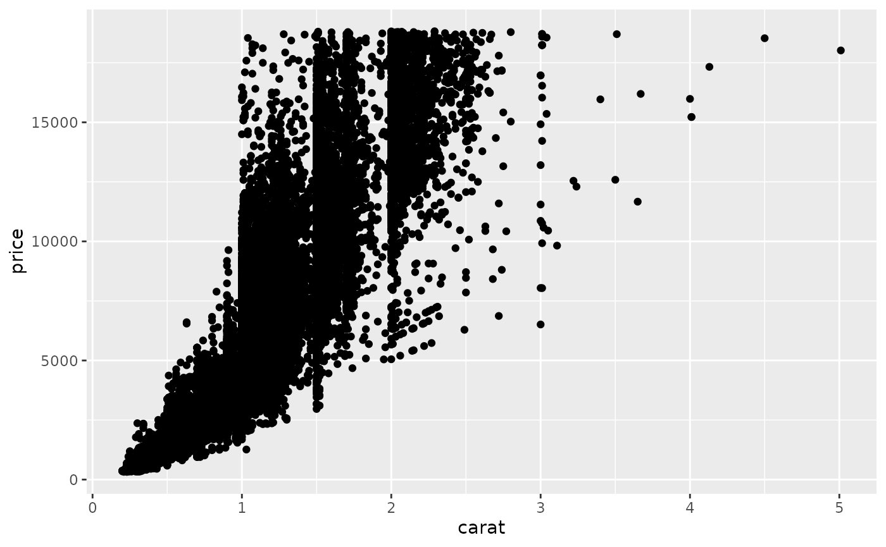
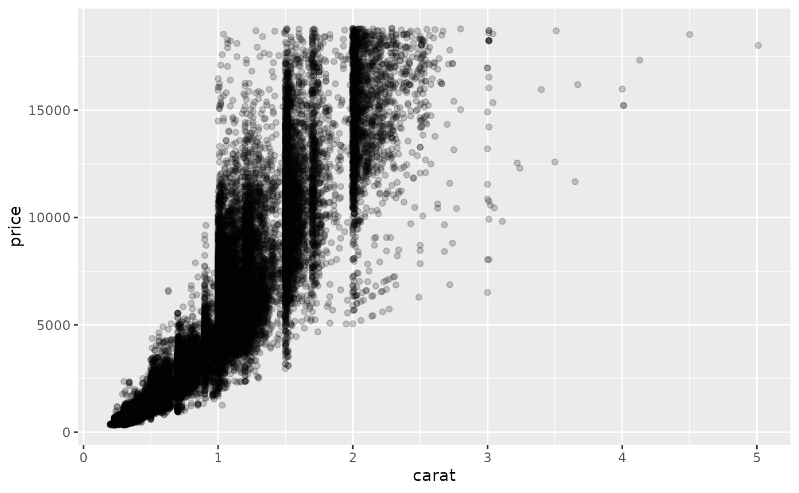
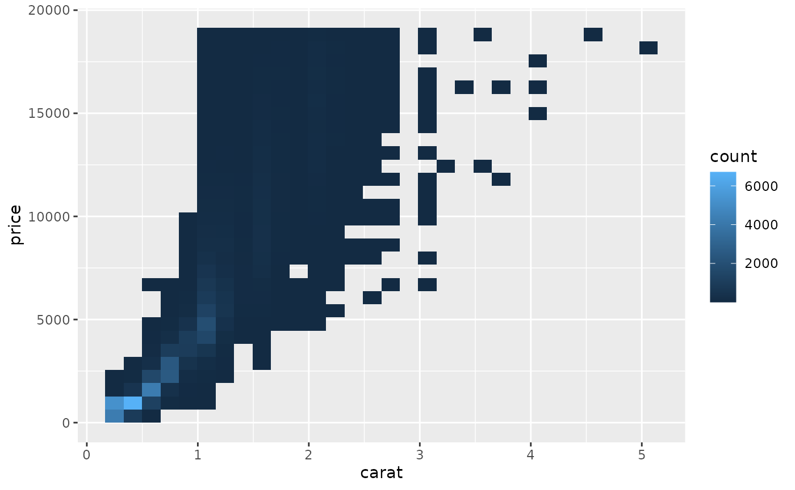
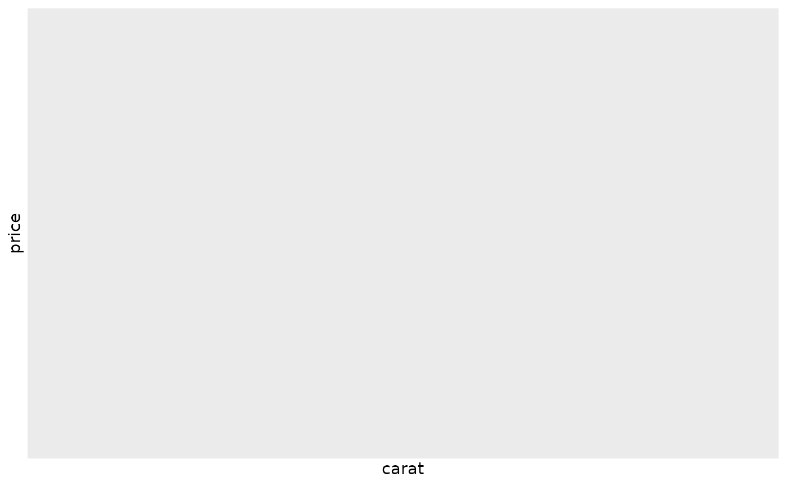
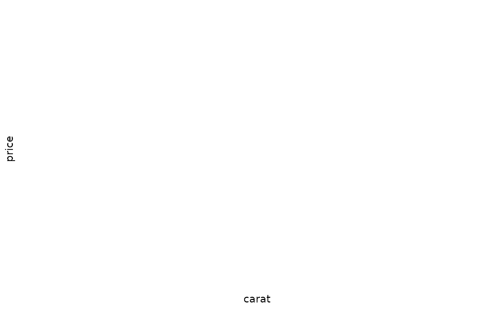
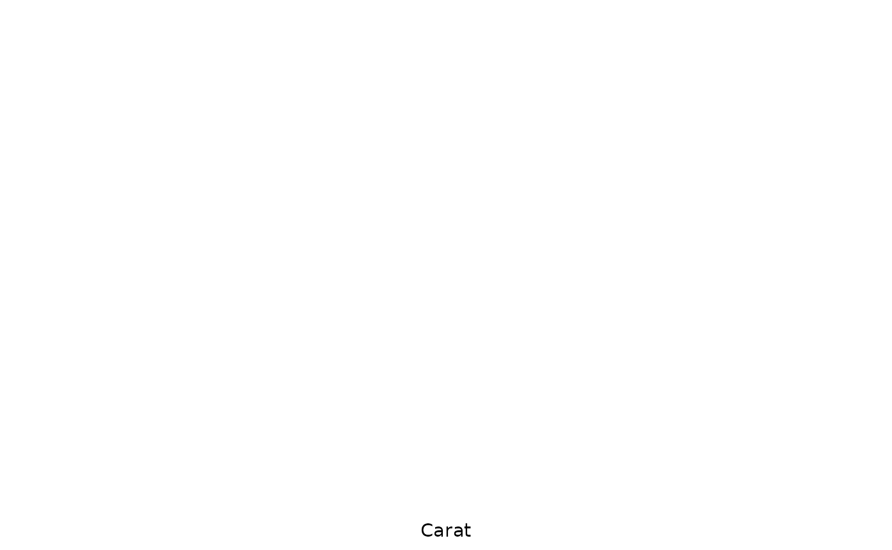
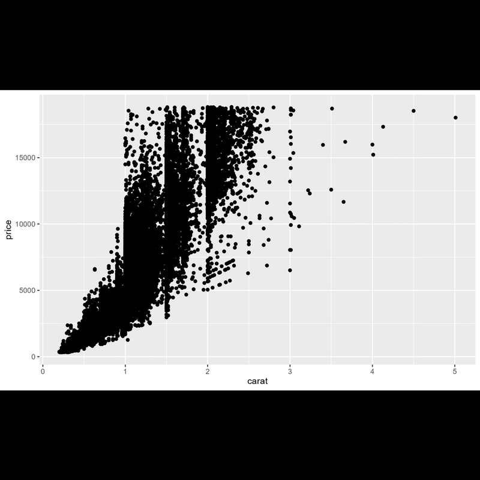

# Create animations of your design process

The main purpose of
[camcorder](https://thebioengineer.github.io/camcorder/) is the
recording of all steps involved in a data visualization design with the
ultimate goal to generate an animated gif file of all steps. (For more
on the pretty cool side effects for your workflow thanks to
[camcorder](https://thebioengineer.github.io/camcorder/) look
[here](camcorder_view.md)).

## Start a Recording with `gg_record()`

We initialize a recording with the
[`gg_record()`](../reference/Recording.md) function. After running the
following code, [camcorder](https://thebioengineer.github.io/camcorder/)
is *saving a file with the given specifications in the given directory
every time
[`ggplot()`](https://ggplot2.tidyverse.org/reference/ggplot.html) is
called*.

``` r

library(camcorder)

gg_record(
  dir = file.path(tempdir(), "recording"), 
  device = "png", # we need to set the Cairo device
  width = 8,
  height = 5
)
```

*Note: If you want to keep your plot files afterwards, set the `dir` in
`gg_record` to a permanent directory (instead of a temporary directory
as in our examples).*

Now we can start building our plot:

``` r

ggplot(diamonds, aes(x = carat, y = price)) +
  geom_point()
```



``` r


ggplot(diamonds, aes(x = carat, y = price)) +
  geom_point(alpha = .2)
```



``` r


ggplot(diamonds, aes(x = carat, y = price)) +
  geom_bin2d()
```



``` r


ggplot(diamonds, aes(x = carat, y = price)) +
  geom_hex()
```


``` r


ggplot(diamonds, aes(x = carat, y = price)) +
  geom_hex() +
  scale_fill_viridis_c(option = "magma")
```


``` r


ggplot(diamonds, aes(x = carat, y = price)) +
  geom_hex() +
  scale_fill_viridis_c(option = "magma", direction = -1)
```


``` r


ggplot(diamonds, aes(x = carat, y = price)) +
  geom_hex() +
  scale_fill_viridis_b(option = "magma", direction = -1)
```


``` r


ggplot(diamonds, aes(x = carat, y = price)) +
  geom_hex(color = "white") +
  scale_fill_viridis_b(option = "magma", direction = -1)
```



``` r


ggplot(diamonds, aes(x = carat, y = price)) +
  geom_hex(color = "white") +
  scale_fill_viridis_b(option = "magma", direction = -1) +
  theme_minimal()
```



``` r


ggplot(diamonds, aes(x = carat, y = price)) +
  geom_hex(color = "white") +
  scale_fill_viridis_b(option = "magma", direction = -1) +
  theme_minimal() +
  theme(panel.grid.minor = element_blank())
```


``` r


ggplot(diamonds, aes(x = carat, y = price)) +
  geom_hex(color = "white") +
  coord_cartesian(clip = "off") +
  scale_y_continuous(labels = scales::dollar_format()) +
  scale_fill_viridis_b(option = "magma", direction = -1) +
  theme_minimal() +
  theme(panel.grid.minor = element_blank()) +
  labs(x = "Carat", y = NULL, fill = "Number of diamonds")
```


``` r


ggplot(diamonds, aes(x = carat, y = price)) +
  geom_hex(color = "white") +
  coord_cartesian(clip = "off") +
  scale_y_continuous(labels = scales::dollar_format()) +
  scale_fill_viridis_b(option = "magma", direction = -1) +
  theme_minimal() +
  theme(
    panel.grid.minor = element_blank(),
    legend.position = "top"
  ) +
  labs(x = "Carat", y = NULL, fill = "Number of diamonds")
```


``` r


g <- 
  ggplot(diamonds, aes(x = carat, y = price)) +
  geom_hex(color = "white") +
  coord_cartesian(clip = "off") +
  scale_y_continuous(labels = scales::dollar_format()) +
  scale_fill_viridis_b(
    option = "magma", direction = -1,
    guide = guide_colorsteps(
      title.position = "top", show.limits = TRUE, 
      barwidth = unit(16, "lines"), barheight = unit(.8, "lines")
    )
  ) +
  theme_minimal() +
  theme(
    panel.grid.minor = element_blank(),
    legend.position = "top"
  ) +
  labs(x = "Carat", y = NULL, fill = "Number of diamonds")

g
```



## Resize Plots with `gg_resize_film()`

The hex grid looks a bit off, so let’s change the aspect ratio as a
final step by calling the
[`gg_resize_film()`](../reference/Recording.md) function:

``` r

gg_resize_film(
  height = 5,
  width = 5,
  units = "in",
  dpi = 600
)
```

``` r

g
```


## Create a GIF with `gg_playback()`

Once we are happy with the visualization, we can create an animation
using all the automatically saved plots:

``` r

gg_playback(
  name = file.path(tempdir(), "recording", "diamonds.gif"),
  first_image_duration = 4,
  last_image_duration = 12,
  frame_duration = .5,
  image_resize = 900,
  width = 800,
  height = 800
)
```

Once rendering is complete, a gif is saved and then opened in your
viewer.



## End a Recording with `gg_stop_recording()`

If you ever wish to stop the automatic saving, just
run[`gg_stop_recording()`](../reference/Recording.md).
