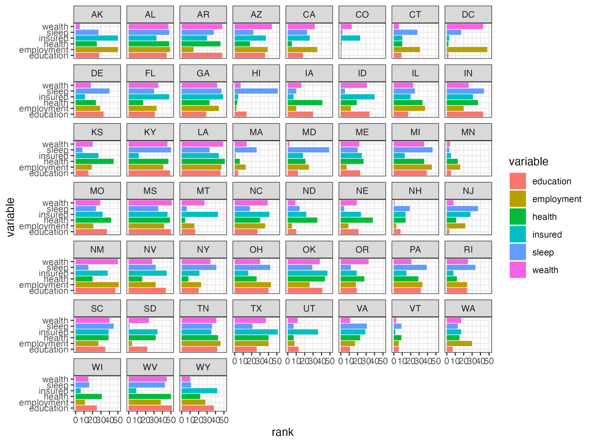
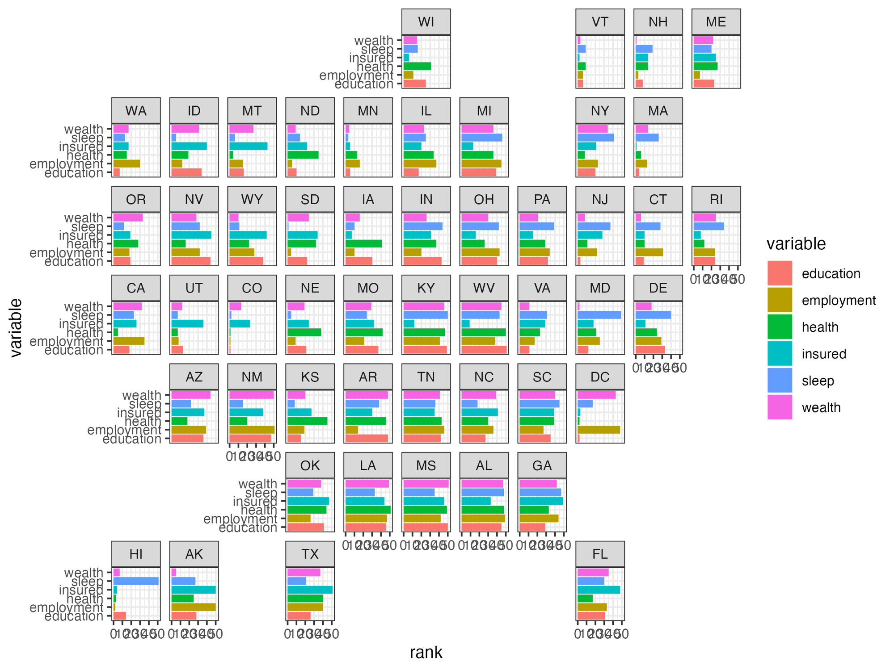
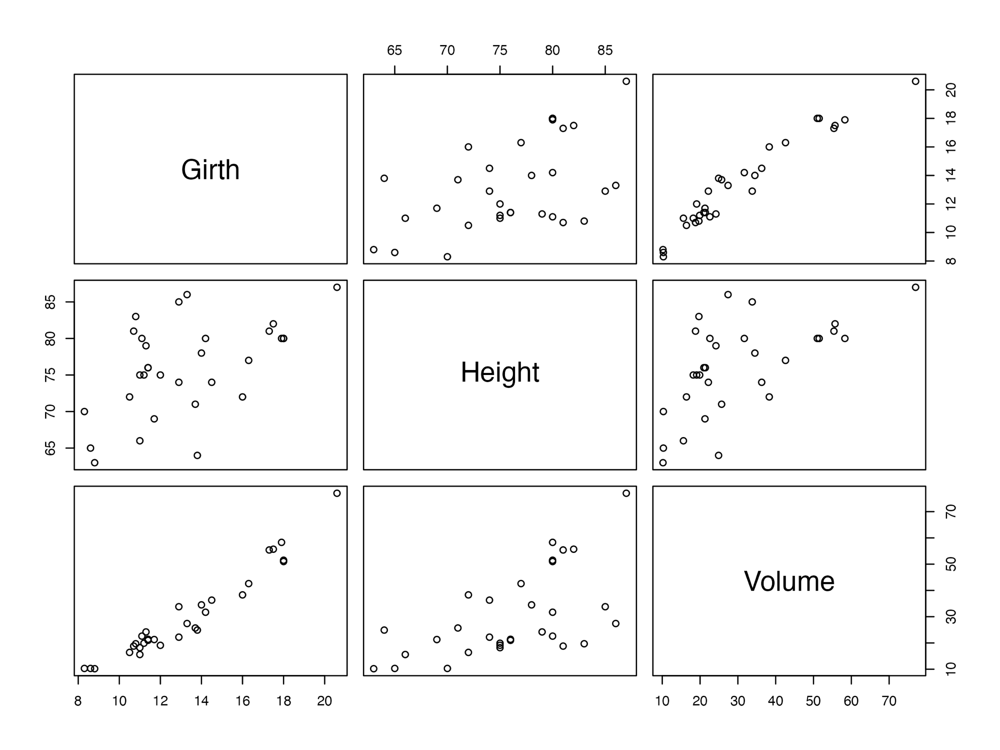

# Capture plots from other devices with record_polaroid()

[camcorder](https://thebioengineer.github.io/camcorder/) overrides
functions like `print.ggplot` or `print.patchwork` to capture plots. In
some cases though, when other functions are used to print plots,
[camcorder](https://thebioengineer.github.io/camcorder/) cannot
automatically grab them.
[`record_polaroid()`](../reference/record_polaroid.md) provides a way to
expand the capturing capabilities of
[camcorder](https://thebioengineer.github.io/camcorder/) to other
devices.

This can be achieved by adding
[`record_polaroid()`](../reference/record_polaroid.md) after the code
used for plotting. Although
[`record_polaroid()`](../reference/record_polaroid.md) has to be called
manually, it allows saving a plot with the settings of an existing
[camcorder](https://thebioengineer.github.io/camcorder/) setup, like
width, height, or directory.

This is particularly useful when you have an ongoing recording of
ggplot2 code and then start using a package that has its own printing
function, like [geofacet](https://github.com/hafen/geofacet).

## Example with `{geofacet}`

In this example, we only use the `state_ranks` dataset from
[geofacet](https://github.com/hafen/geofacet) but no functions from the
package. Our basic
[camcorder](https://thebioengineer.github.io/camcorder/) setup works as
expected.

``` r

library(ggplot2)
library(geofacet)
library(camcorder)

gg_record(device = "png", width = 8, height = 6)

ggplot(state_ranks) +
  geom_col(aes(variable, rank, fill = variable)) +
  coord_flip() +
  facet_wrap(vars(state)) +
  theme_bw()
```



If we were to replace the
[`facet_wrap()`](https://ggplot2.tidyverse.org/reference/facet_wrap.html)
function with `facet_geo()` though, no plot would be saved, since
[geofacet](https://github.com/hafen/geofacet) uses its own printing
function. This is where
[`record_polaroid()`](../reference/record_polaroid.md) comes in. By
adding it (no arguments needed),
[camcorder](https://thebioengineer.github.io/camcorder/) saves the plot
in the same directory and with the same dimensions.

``` r

library(ggplot2)
library(geofacet)
library(camcorder)

gg_record(
  dir = file.path(tempdir(), "recording"),
  device = "png",
  width = 8,
  height = 6
)

ggplot(state_ranks) +
  geom_col(aes(variable, rank, fill = variable)) +
  coord_flip() +
  facet_geo(vars(state)) +
  theme_bw()

record_polaroid()
```



## Example with base R

[`record_polaroid()`](../reference/record_polaroid.md) can be used with
base R plots as well. Not only does it saves the plot but it also
displays the image in RStudio’s Viewer pane with the desired dimensions
declared in [`gg_record()`](../reference/Recording.md).

``` r

library(camcorder)

gg_record(
  dir = file.path(tempdir(), "recording"),
  device = "png",
  width = 8,
  height = 6
)

plot(trees)

record_polaroid()
```


