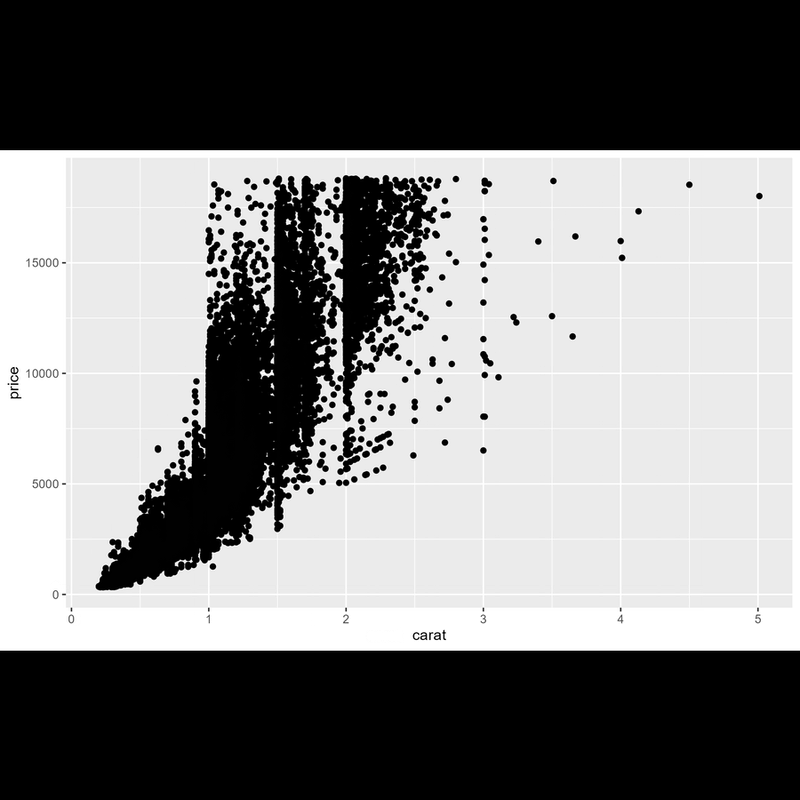

```{r, include = FALSE}
knitr::opts_chunk$set(
  collapse = TRUE,
  comment = "#>",
  warning = FALSE,
  message = FALSE
)
```

The main purpose of `{camcorder}` is the recording of all steps involved in a data visualization design with the ultimate goal to generate an animated gif file of all steps. (For more on the pretty cool side effects for your workflow thanks to `{camcorder}` look [here](camcorder_view.html)).

## Start a Recording with `gg_record()`

We initialize a recording with the `gg_record()` function. After running the following code, `{camcorder}` is *saving a file with the given specifications in the given directory every time `ggplot()` is called*.

```{r setup-record, eval=FALSE}
library(ggplot2)
library(camcorder)

gg_record(
  dir = file.path(tempdir(), "recording"), 
  device = "png", # we need to set the Cairo device
  width = 8,
  height = 5
)
```

*Note: If you want to keep your plot files afterwards, set the `dir` in `gg_record` to a permanent directory (instead of a temporary directory as in our examples).*

Now we can start building our plot:

```{r load-ggplot-hidden, include=FALSE}
library(ggplot2)
```

```{r style-diamonds-plot}
ggplot(diamonds, aes(x = carat, y = price)) +
  geom_point()

ggplot(diamonds, aes(x = carat, y = price)) +
  geom_point(alpha = .2)

ggplot(diamonds, aes(x = carat, y = price)) +
  geom_bin2d()

ggplot(diamonds, aes(x = carat, y = price)) +
  geom_hex()

ggplot(diamonds, aes(x = carat, y = price)) +
  geom_hex() +
  scale_fill_viridis_c(option = "magma")

ggplot(diamonds, aes(x = carat, y = price)) +
  geom_hex() +
  scale_fill_viridis_c(option = "magma", direction = -1)

ggplot(diamonds, aes(x = carat, y = price)) +
  geom_hex() +
  scale_fill_viridis_b(option = "magma", direction = -1)

ggplot(diamonds, aes(x = carat, y = price)) +
  geom_hex(color = "white") +
  scale_fill_viridis_b(option = "magma", direction = -1)

ggplot(diamonds, aes(x = carat, y = price)) +
  geom_hex(color = "white") +
  scale_fill_viridis_b(option = "magma", direction = -1) +
  theme_minimal()

ggplot(diamonds, aes(x = carat, y = price)) +
  geom_hex(color = "white") +
  scale_fill_viridis_b(option = "magma", direction = -1) +
  theme_minimal() +
  theme(panel.grid.minor = element_blank())

ggplot(diamonds, aes(x = carat, y = price)) +
  geom_hex(color = "white") +
  coord_cartesian(clip = "off") +
  scale_y_continuous(labels = scales::dollar_format()) +
  scale_fill_viridis_b(option = "magma", direction = -1) +
  theme_minimal() +
  theme(panel.grid.minor = element_blank()) +
  labs(x = "Carat", y = NULL, fill = "Number of diamonds")

ggplot(diamonds, aes(x = carat, y = price)) +
  geom_hex(color = "white") +
  coord_cartesian(clip = "off") +
  scale_y_continuous(labels = scales::dollar_format()) +
  scale_fill_viridis_b(option = "magma", direction = -1) +
  theme_minimal() +
  theme(
    panel.grid.minor = element_blank(),
    legend.position = "top"
  ) +
  labs(x = "Carat", y = NULL, fill = "Number of diamonds")

g <- 
  ggplot(diamonds, aes(x = carat, y = price)) +
  geom_hex(color = "white") +
  coord_cartesian(clip = "off") +
  scale_y_continuous(labels = scales::dollar_format()) +
  scale_fill_viridis_b(
    option = "magma", direction = -1,
    guide = guide_colorsteps(
      title.position = "top", show.limits = TRUE, 
      barwidth = unit(16, "lines"), barheight = unit(.8, "lines")
    )
  ) +
  theme_minimal() +
  theme(
    panel.grid.minor = element_blank(),
    legend.position = "top"
  ) +
  labs(x = "Carat", y = NULL, fill = "Number of diamonds")

g
```

## Resize Plots with `gg_resize_film()`

The hex grid looks a bit off, so let's change the aspect ratio as a final step by calling the `gg_resize_film()` function:

```{r resize, eval=FALSE}
gg_resize_film(
  height = 5,
  width = 5,
  units = "in",
  dpi = 600
)
```

```{r plot-new-width, fig.width=5, fig.height=5}
g
```

```{r setup-record, eval=TRUE, echo=FALSE}
```

```{r style-diamonds-plot, eval=TRUE, echo=FALSE}
```

```{r resize, eval=TRUE, echo=FALSE}
```

```{r plot-new-width, eval=TRUE, echo=FALSE}
```

## Create a GIF with `gg_playback()`

Once we are happy with the visualization, we can create an animation using all the automatically saved plots:

```{r playback}
gg_playback(
  name = file.path(tempdir(), "recording", "diamonds.gif"),
  first_image_duration = 4,
  last_image_duration = 12,
  frame_duration = .5,
  image_resize = 900,
  width = 800,
  height = 800
)
```

Once rendering is complete, a gif is saved and then opened in your viewer.



## End a Recording with `gg_stop_recording()`

If you ever wish to stop the automatic saving, just run`gg_stop_recording()`.
