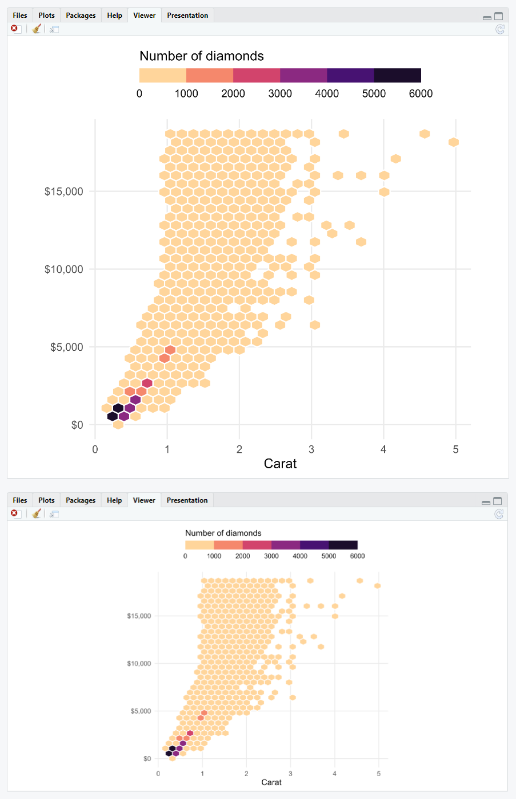

```{r, include = FALSE}
knitr::opts_chunk$set(
  collapse = TRUE,
  comment = "#>",
  warning = FALSE,
  message = FALSE
)

options(rmarkdown.html_vignette.check_title = FALSE)
```

There a other pretty cool features when recording your ggplot output with the `{camcorder}` that improve the workflow with `{ggplot2}`: 

1.  you don't need to run `ggsave()` every time after your `ggplot()` call
2.  you can inspect the plot in the given dimensions **inside** Rstudio


## Omit Running and Typing `ggsave()` 

That is the obvious feature: as `{camcorder}` saves a file with the given specifications in the given directory every time `ggplot()` is called you don't have to run `ggsave()` after a `ggplot()` function call.   
Also, you don't need to type or copy-paste and modify multiple `ggsave()` snippets which e.g. avoids overwriting your previous plot by default and keeps your code clean.

If you want to keep your plot files after the session, set the `dir` in `gg_record` to a permanent directory (instead of a temporary directory as in our examples).


## Inspect the Final Plot Directly with Specified Dimensions

An often raised question is the responsive behavior of the `Plots` pane in the RStudio IDE. The dimensions used in that pane rely on the window size and are not at all related to any `width` and `height` in your script. That leads to the annoying user experience that one spends tremendous time on styling the size of geometries and theme elements—but once saved everything looks differently and likely off.

As `{camcorder}` is saving a plot file anyway, we make use of that and display the saved file in the `Viewer` pane of the RStudio IDE. Since the image was saved with the previously custom settings, the dimensions of the plot shown here matches exactly as you would use the same settings in a `ggsave()` call.



Note how the size of the geometries and elements stays the same independently of the window size and aspect ratio.
