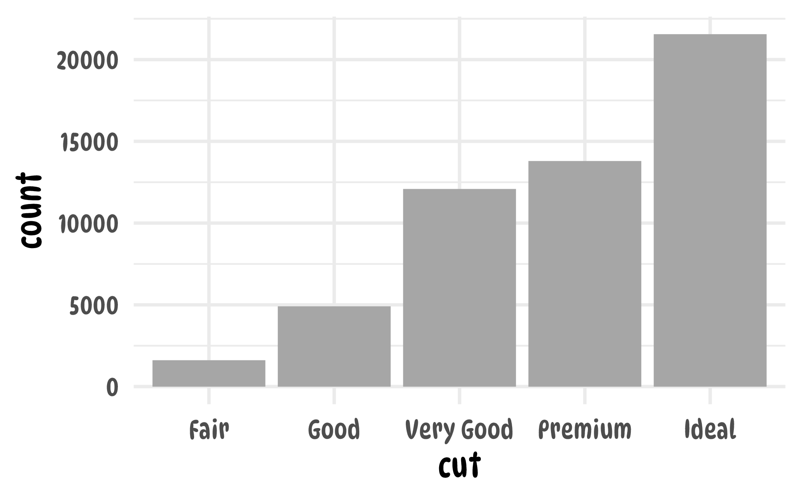
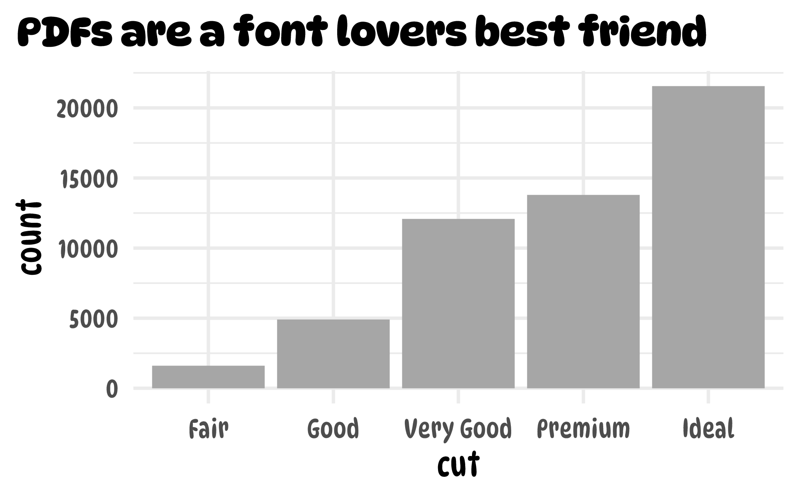

```{r, include = FALSE}
knitr::opts_chunk$set(
  collapse = TRUE,
  comment = "#>",
  warning = FALSE,
  message = FALSE
)
```

`{camcorder}` doesn't only work with raster images such as PNG and JPEG but also PDF files. There are some benefits of using the PDF format when saving ggplot output: vector graphics are *lossless*, can be converted easily in raster formats of any resolution and also be manipulated afterwards in a vector design tool. Furthermore, the PDF format often supports the use of custom fonts (when using the Cairo device)[^f1].

[^f1]: Thanks to the `{ragg}` package custom font support is working quite well for raster images now—but it's not a vector graphic 🙃

To automatically save your graphics in PDF format, just change the device setting to `cairo_pdf`[^f2] when recording your ggplot code:

[^f2]: [Cairo](https://en.wikipedia.org/wiki/Cairo_(graphics)) is an open-source graphics library that is [known to work very well with custom fonts](https://www.andrewheiss.com/blog/2017/09/27/working-with-r-cairo-graphics-custom-fonts-and-ggplot/).

```{r setup-record-pdf}
library(ggplot2)
library(camcorder)

gg_record(
  dir = file.path(tempdir(), "recording"), 
  device = cairo_pdf, # we need to set the Cairo device
  width = 8,
  height = 5
)
```

*Mac users should ensure that [XQuartz is installed](https://www.xquartz.org/) which is needed to use the cairo pdf device.*

To supply custom fonts in R, the respective font needs to be installed locally on the system. 

You can make sure the font file is installed by using the `system_fonts()` from the latest standard, the `{systemfont}` package:

```{r font-list}
systemfonts::system_fonts()
```

You can simply filter this tibble for any font:[^f3]

[^f3]: To make the difference obvious we use the fun, quirky font [DynaPuff](https://github.com/googlefonts/dynapuff) which is freely available.

```{r font-search}
systemfonts::system_fonts() |> 
  dplyr::filter(grepl("Dyna", family)) |>
  dplyr::pull(name) |> 
  sort()
```

Now let's create a graphic with the DynaPuff Condensed typeface as the `base_family` of our theme:

```{r plot-base-family, eval=FALSE}
g <- 
  ggplot(diamonds, aes(x = cut)) + 
  geom_bar(fill = "grey65") +
  theme_minimal(
    base_family = "DynaPuff Condensed",
    base_size = 24
  )

g
```



And now let's add a non-condensed, bold title:

```{r plot-title-family, eval=FALSE}
g +
  ggtitle("PDFs are a font lovers best friend") +
  theme(
    plot.title.position = "plot",
    plot.title = element_text(family = "DynaPuff", face = "bold")
  )
```



That's it. If you want to know more about good practices how to handle and customize fonts in `{ggplot2}` check this [blog post by June Choe](https://yjunechoe.github.io/posts/2021-06-24-setting-up-and-debugging-custom-fonts/).


