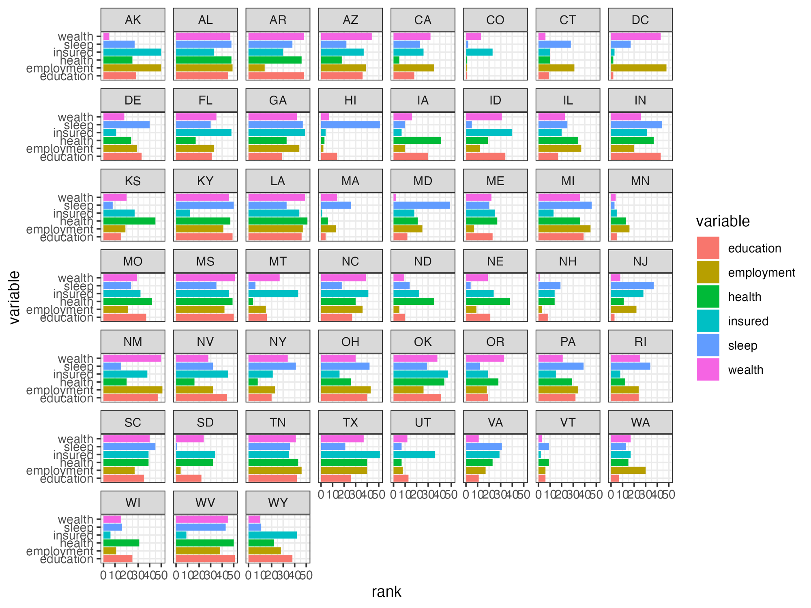
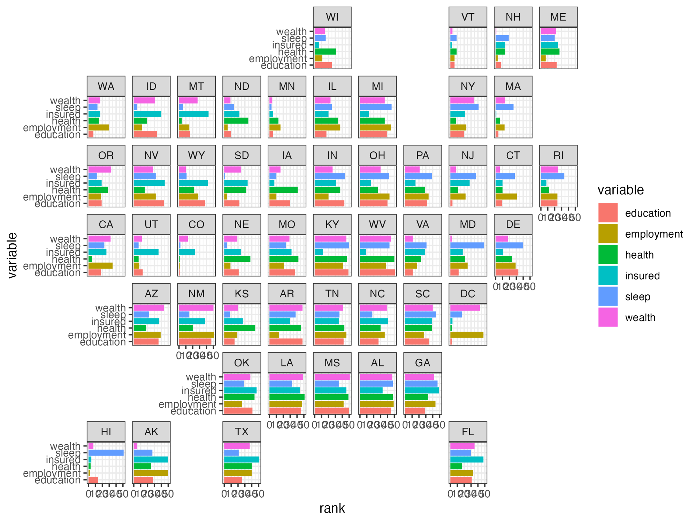
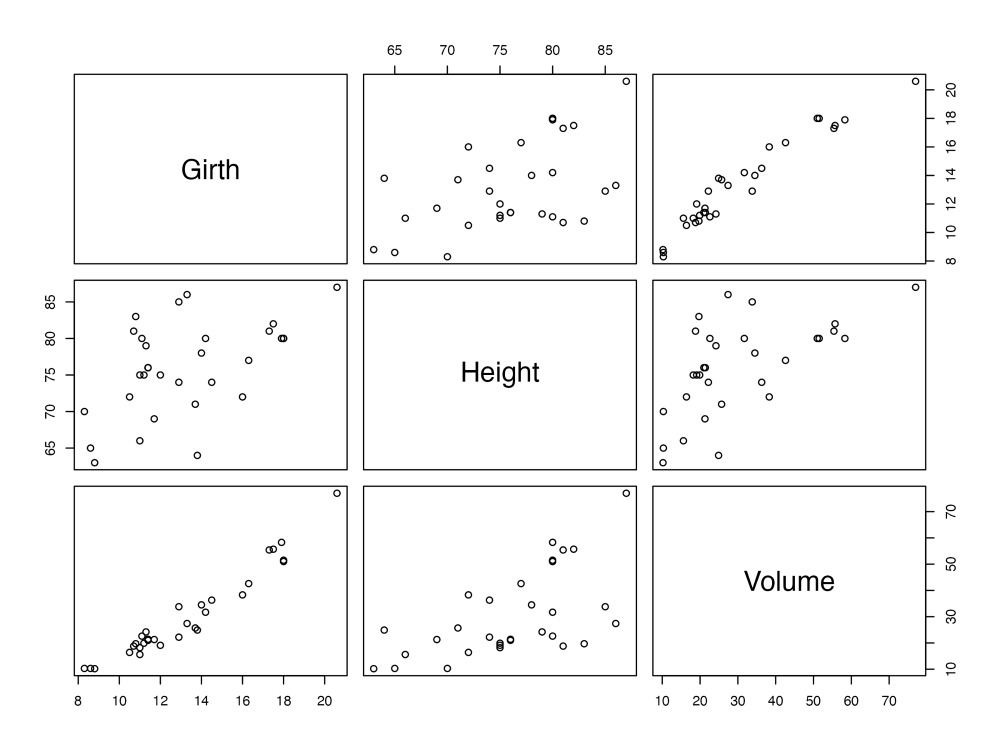

```{r, include = FALSE}
knitr::opts_chunk$set(
  collapse = TRUE,
  comment = "#>",
  warning = FALSE,
  message = FALSE
)
```

`{camcorder}` overrides functions like `print.ggplot` or `print.patchwork` to capture plots. In some cases though, when other functions are used to print plots, `{camcorder}` cannot automatically grab them. `record_polaroid()` provides a way to expand the capturing capabilities of `{camcorder}` to other devices.

This can be achieved by adding `record_polaroid()` after the code used for plotting. Although `record_polaroid()` has to be called manually, it allows saving a plot with the settings of an existing `{camcorder}` setup, like width, height, or directory.

This is particularly useful when you have an ongoing recording of ggplot2 code and then start using a package that has its own printing function, like `{geofacet}`.

## Example with `{geofacet}`

In this example, we only use the `state_ranks` dataset from `{geofacet}` but no functions from the package. Our basic `{camcorder}` setup works as expected.

```{r geofacet-example, eval=FALSE}
library(ggplot2)
library(geofacet)
library(camcorder)

gg_record(device = "png", width = 8, height = 6)

ggplot(state_ranks) +
  geom_col(aes(variable, rank, fill = variable)) +
  coord_flip() +
  facet_wrap(vars(state)) +
  theme_bw()
```

{width=600px}

If we were to replace the `facet_wrap()` function with `facet_geo()` though, no plot would be saved, since `{geofacet}` uses its own printing function. This is where `record_polaroid()` comes in. By adding it (no arguments needed), `{camcorder}` saves the plot in the same directory and with the same dimensions.

```{r geofacet2-example, eval=FALSE}
library(ggplot2)
library(geofacet)
library(camcorder)

gg_record(
  dir = file.path(tempdir(), "recording"),
  device = "png",
  width = 8,
  height = 6
)

ggplot(state_ranks) +
  geom_col(aes(variable, rank, fill = variable)) +
  coord_flip() +
  facet_geo(vars(state)) +
  theme_bw()

record_polaroid()
```
{width=600px}


## Example with base R

`record_polaroid()` can be used with base R plots as well. Not only does it saves the plot but it also displays the image in RStudio's Viewer pane with the desired dimensions declared in `gg_record()`.

```{r base_r-example, eval=FALSE}
library(camcorder)

gg_record(
  dir = file.path(tempdir(), "recording"),
  device = "png",
  width = 8,
  height = 6
)

plot(trees)

record_polaroid()
```
{width=600px}
